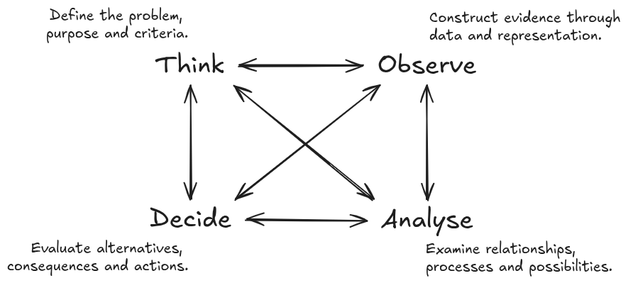

slide_title: GIX - Orientation - 2026
custom_css: ./remarkjs/Nord-storm.css
highlight_style: vs
aspect_ratio: 16:9
remarkjs_path: ./remarkjs/remark-0.15.0.js
use_mathjax: true
use_mermaid: true
add_sidebar: true
add_searchbar: true
use_click: false
use_scroll: true
favicon: ./resources/favicon.ico

name: inverse
layout: true
class: center, middle, inverse
---

# Welcome to GIX
------
## Geography × Computing

.square.bold.xx-large[A guide for the first GIX cohort · AY2026/27]

---
layout: false
class: left, middle
.split-30[.column[
# How to use this guide
].column[
This guide introduces:

- what GIX is and how its two foundations connect;
- what you will learn across the four-year programme;
- how to approach university learning in an AI-rich environment;
- practical habits that can help you succeed; and
- the people, information and support available to you.

You do not need to remember everything now. Save this guide and return to the relevant sections as you progress through your first year.
]]

---
class: left, middle, inverse

# Contents
------
1. **Understanding GIX** — the identity and purpose of the programme
2. **Your four-year journey** — how your learning develops
3. **Learning in GIX** — TOAD, integration and human judgement
4. **Working with AI** — support without surrendering learning
5. **Making the most of university** — attention, persistence and community
6. **Information and next steps** — where to find help

---
class: center, middle, inverse

# 1 · Understanding GIX
------
.square.bold.xx-large[A programme built across Geography and Computing]

---
class: left, middle

## You are the first GIX cohort

You are joining a new four-year direct honours programme jointly offered by the **Faculty of Arts and Social Sciences** and the **School of Computing**.

As the first cohort, you will do more than follow an established path. Your experiences and feedback will help shape the programme's culture and development for future students.

You will enter with different academic backgrounds and strengths. That diversity is expected—and it can become one of the cohort's greatest resources.

---
class: left, middle

## What does “cross-disciplinary” mean?

GIX is not simply a collection of Geography courses placed beside a collection of Computing courses.

You will learn to connect:

- geographical questions with computational approaches;
- knowledge of places and processes with data and models;
- technical possibilities with social and environmental consequences; and
- analytical results with responsible decisions.

The goal is **integration**: knowing what each discipline contributes, where each has limitations and how they can work together.

---
class: left, middle

## GIX connects two foundations

.split-50[.column[
.bold.xx-large[Geography helps you understand the world]

- Places 
- People 
- Environments 
- Relationships 
- Scale 
- Change
].column[
.bold.xx-large[Computing expands what you can do]

- Represent 
- Organise 
- Analyse 
- Model 
- Automate 
- Build
]]

.footnote[Together, they support **location intelligence for real-world problems**.]

---
class: left, middle

## What is Geospatial Intelligence?

In GIX, geospatial intelligence is more than making maps or operating GIS software.

It involves using information about **location, distance, distribution, connection, movement, context and scale** to understand geographical phenomena and support decisions.

This may involve maps, spatial data, programming, statistics, algorithms, simulation, visualisation and artificial intelligence—but the technology is always connected to a geographical question.

---
class: left, middle

## The questions begin before the technology

Geospatial inquiry may begin with questions such as:

- What is happening, and where?
- Why does it happen differently across places?
- Who and what are represented in the data—and what may be missing?
- What relationships and processes could produce the observed pattern?
- How might conditions change under a different scenario?
- What should be done, for whom and with what consequences?

Technology can help investigate these questions. It cannot decide by itself which questions deserve attention.

---
class: left, middle

## GIX can contribute across many fields

The same foundations can support very different applications:

- understanding urban movement and transport systems;
- examining access to healthcare, education and public services;
- monitoring environmental change and climate-related risk;
- modelling disease transmission and population processes;
- analysing business locations and service areas;
- supporting planning, logistics and emergency response; and
- developing geospatial software, data systems and GeoAI.

You are not expected to choose one pathway immediately. Use your early years to explore what interests you.

---
class: center, middle, inverse

# 2 · Your four-year journey
------
.square.bold.xx-large[Foundations → Capabilities → Integration → Contribution]

---
class: left, middle

## Year 1 · Build .red[foundations]

.split-20[.column[
- .red[Year 1]
- Year 2
- Year 3
- Year 4

].column[

Your first year develops the basic languages of the programme:

- geographical thinking about place, scale, relationships and context;
- programming and computational problem-solving;
- working with data and evidence; and
- adapting to independent university learning.

You do not need to arrive as an experienced programmer or geographer. What matters is regular practice, curiosity and a willingness to ask for help.
]]

---
class: left, middle

## Year 2 · Develop .red[capabilities]

.split-20[.column[
- Year 1
- .red[Year 2]
- Year 3
- Year 4

].column[

You will begin connecting foundational ideas through areas such as:

- geographic information systems (GIS);
- data structures and algorithms;
- statistics and spatial analysis;
- databases, data management and computational methods; and
- the representation and visualisation of geographical phenomena.

This is often where subjects that initially seemed separate begin to support one another.
]]

---
class: left, middle

## Year 3 · .red[Connect and apply]

.split-20[.column[
- Year 1
- Year 2
- .red[Year 3]
- Year 4

].column[

As your foundations strengthen, you will work with more advanced and open-ended problems through:

- advanced geospatial analysis and modelling;
- GeoAI and data-intensive methods;
- application areas such as cities, mobility or the environment;
- interdisciplinary teamwork; and
- projects requiring choices about data, methods and evaluation.

The emphasis gradually shifts from following a defined procedure to designing and justifying your own approach.
]]

---
class: left, middle

## Year 4 · .red[Integrate and contribute]

.split-20[.column[
- Year 1
- Year 2
- Year 3
- .red[Year 4]

].column[

Your later studies provide opportunities to bring the programme together through:

- advanced electives and specialised applications;
- independent or capstone work;
- professional or research-oriented projects; and
- an Industrial Attachment of up to six months, where applicable.

By graduation, you should be able to connect geographical understanding, computational capability and human judgement when addressing unfamiliar problems.
]]

---
class: left, middle

## Foundations are not boxes to clear

Ideas introduced early will return in more advanced forms:

- **Programming** supports later modelling, automation and GeoAI.
- **Algorithms** shape what can be computed and how efficiently it can be done.
- **Statistics** supports inference, uncertainty assessment and evaluation.
- **GIS and spatial analysis** connect data with location and spatial relationships.
- **Geography** gives data and models their environmental and social context.
- **Communication** makes technical work interpretable and useful to others.

Try to connect courses rather than treating each one as an isolated requirement.

---
class: left, middle

## Plan with prerequisites in mind

Some advanced courses depend on knowledge developed in earlier courses. Delaying a prerequisite may therefore affect later choices.

Before each course-registration period:

1. Review the recommended study plan.
2. Check prerequisites and preclusions.
3. Consider workload across both disciplinary foundations.
4. Discuss uncertainties with the programme's academic advisers.
5. Confirm requirements using the official curriculum source.

**Graduation requirement:** [see Graudation tab](https://chs.nus.edu.sg/programmes/gi/)

---

class: center, middle, inverse

# 3 · Learning in GIX
------
.square.bold.xx-large[Learn to frame, investigate, interpret and decide]

---
class: center, top

## The core components

.card-container[
.card[
  .card-icon[
    <i class="typcn typcn-location-outline"></i>
  ]
  .card-label[
    **Geography**  
Recognise how exposure and accessibility vary across people, places, routes and times.
  ]
]
.card[
  .card-icon[
    <i class="typcn typcn-code-outline"></i>
  ]
  .card-label[
    **Computing**  
Translate the problem into measurable criteria and a structured analytical task.
  ]
]
.card[
  .card-icon[
    <i class="typcn typcn-flow-merge"></i>
  ]
  .card-label[
    **Integrated problem-solving**  
Connect geographical context and computational capabilities to develop meaningful and workable approaches.
  ]
]
]

.footnote.xkcd.bold.red[How to connect them?]

---
class: left, middle
## How inquiry works in GIX - TOAD

 

TOAD represents four interconnected dimensions of geospatial inquiry, each of which can influence the others.

---
class: center, middle

### Following one example through TOAD
------
### .round.bold[.red[Which campus walking routes should be prioritised for better shade and rain protection?]]

---
class: left, middle

.split-50[.column[
## Think
#### What problem are we addressing?
].column[
Thinking determines the purpose and direction of an inquiry. It asks why the problem matters, whose experiences should be considered and what would count as a good outcome.
]]

---
class: left, middle

### In our campus example

“Improve covered walkways” is still too broad. We need to ask:

- Are we addressing heat, rain or both?
- Should we prioritise the most frequently used routes?
- Should accessible routes receive additional priority?
- Are we improving complete journeys or individual exposed segments?
- How should cost, feasibility and environmental impact be considered?
- What would count as a successful improvement?

---
class: left, middle

.split-50[.column[
## Observe
#### What evidence do we need?
].column[

Observing is not simply finding an existing dataset. It concerns how real places, people and processes are selected, measured and represented as evidence.
]]

---
class: left, middle

### In our campus example, we might need
.split-50[.column[
- the pedestrian-path network;
- existing covered walkways and shaded areas;
- building entrances and important destinations;
- pedestrian movement or footfall;
].column[
- temperature, solar exposure and rainfall information;
- slope, stairs and accessible routes;
- student and staff experiences; and
- construction constraints and estimated costs.
]]

We must also ask whether the data cover different people, places, times and weather conditions.

> **Data do not simply reproduce the world. Every dataset represents some aspects of reality while leaving others out.**

---
class: left, middle

.split-50[.column[

## Analyse
#### What patterns and possibilities emerge?
].column[

Analysing involves using appropriate methods to examine relationships, interpret patterns, model processes and test possible scenarios.
]]

---
class: left, middle

### In our campus example, we could

- map exposed sections of the walking network;
- identify routes with both high use and high exposure;
- calculate accessibility under different weather conditions;
- compare experiences across groups and times of day;
- identify gaps between existing covered segments;
- model how proposed additions would improve connected journeys; and
- compare alternative investment scenarios.

For example:

> Would one long covered walkway help more people, or would several shorter connections remove more critical gaps?

A technically correct result still requires interpretation. The most frequently used route is not automatically the most important route to improve.

---
class: left, middle

.split-50[.column[

## Decide
#### What should be done?
].column[

Deciding involves comparing alternatives, considering consequences and selecting an appropriate course of action.
]]

---
class: left, middle

### In the example, the decision may consider

.split-50[.column[
- the number and diversity of people who would benefit;
- reductions in heat and rain exposure;
- improvements to accessible and connected journeys;
- construction and maintenance costs;
- environmental effects;
- disruption during construction; and
- uncertainty or limitations in the evidence.
].column[
A recommendation should explain:

- why particular locations were prioritised;
- which groups and criteria were considered;
- what trade-offs were accepted;
- what uncertainty remains; and
- how the outcome will be evaluated.

> **Analysis informs a decision, but it does not make the decision automatically.**
]]

---
class: left, middle

## TOAD is .red[inter-connected]

Thinking, Observing, Analysing and Deciding influence one another throughout an inquiry.

- **Thinking** determines what should be observed.
- **Observing** may change how the problem is understood.
- **Analysing** may reveal missing or unsuitable evidence.
- **Deciding** may require different criteria or further analysis.
- A decision produces new outcomes that can be observed and evaluated.

In the campus example, analysis might reveal that a quiet route is particularly important for accessible travel. This could change the original criteria and require additional evidence.

> **Good geospatial inquiry involves iteration, reflection and revision—not only following a fixed technical workflow.**

---
class: left, middle

## .red[Human agency] remains central

Software and AI may support work across TOAD, but you remain responsible for four essential judgements:

- **Purpose:** What are we trying to understand or achieve?
- **Representation:** How have places, people and processes become data?
- **Interpretation:** What does the result mean within its geographical context?
- **Responsibility:** Who may be affected, and what follows from the decision?

Technical proficiency matters. It becomes more valuable when combined with geographical understanding and responsible judgement.

---
class: left, middle

## Build .red[understanding]—not just information

Finding an answer is not the same as understanding it.

You are developing understanding when you can:

- explain an idea in your own words;
- apply it rather than only recognise it;
- connect it with ideas from different courses;
- identify when and where it is appropriate;
- recognise its assumptions and limitations; and
- adapt it to an unfamiliar problem.

Over four years, you should move from learning concepts and techniques to integrating them independently.

---
class: left, middle

## .red[Difficulty] is part of interdisciplinary learning

Some parts of GIX may initially feel unfamiliar:

- code may fail for reasons that are difficult to see;
- mathematical or statistical ideas may take time to absorb;
- geographical concepts may resist simple computational representation; and
- there may be several defensible approaches rather than one correct answer.

Temporary confusion does not mean that you do not belong. Begin early, work consistently and seek help before uncertainty accumulates.

---

class: center, middle, inverse

# 4 · Studying with AI
------
.square.bold.xx-large[Extend your capabilities .red[without surrendering your learning]]

---
class: left, middle

## AI can .red[support] your work

Depending on the rules of a course or assessment, AI may help you:

- explore an unfamiliar concept;
- compare possible approaches;
- receive another explanation or example;
- explain errors and debug code;
- generate alternatives for evaluation; and
- obtain feedback on clarity or structure.

.bold[AI use is most educational when it helps you .red[think, test and revise], rather than merely produce something to submit.]

---
class: left, middle

## .red[You remain responsible] for the result

When using AI, you should still be able to:

- explain every important idea and decision in your work;
- verify factual claims, calculations, citations and code;
- identify uncertainty, bias and missing context;
- distinguish plausible language from reliable evidence;
- comply with the rules of the course and assessment; and
- defend the final interpretation in your own words.

.bold[.red[Never assume] that fluent or confident output is necessarily correct.]

---
class: left, middle

## AI does not replace .red[geographical context]

A technically valid output can still be geographically misleading.

Consider whether:

- the data represent the relevant population, place and time;
- boundaries or spatial units affect the conclusion;
- relationships change across locations or scales;
- observed patterns reflect the proposed process; and
- a recommendation has different consequences for different communities.

.bold[These questions require .red[geographical] reasoning, .red[domain] knowledge and .red[human] judgement.]

---
class: left, middle

## Check the .red[rules] for every course

Permitted AI use may differ across courses and assessments. An activity allowed for practice may not be allowed in a graded task.

Before using AI for assessed work:

1. Read the course and assessment instructions.
2. Ask the instructor if the permitted use is unclear.
3. Record or acknowledge AI assistance when required.
4. Keep evidence of your own process and understanding.
5. Follow university academic-integrity requirements.

**University guidance:** [AI Guidelines for students](https://libguides.nus.edu.sg/new2nus/ai_guidelines_infographics)

---
class: center, middle, inverse

# 5 · Making the most of university
------
.square.bold.xx-large[The person you develop matters alongside the skills you acquire]

---
class: left, middle

## .red[Care] about something

You do not need to identify a lifelong specialisation now. University gives you time to explore subjects, questions and possible contributions.

Notice what repeatedly draws your curiosity:

- a question you want to understand more deeply;
- a problem you would like to help address;
- a place or community you want to learn from; or
- a process that you find unexpectedly fascinating.

.red[Caring] gives technical .red[learning direction] and helps sustain effort when the work becomes difficult.

---
class: left, middle

## Choose what deserves .red[your attention]

Your attention is limited, and many systems are designed to compete for it. What you repeatedly attend to gradually shapes your knowledge, habits and interests.

Create space for sustained work:

- set aside periods without constant notifications;
- read beyond summaries when a topic matters;
- attempt a problem before immediately searching for an answer; and
- allow yourself to remain with an unresolved question.

Concentration is not a fixed talent. It is a capacity that can be protected and developed.

.footnote-right.xkcd[Attention Is All You Need!]

---
class: left, middle

## Stay with .red[difficult] work

University problems often require more than a quick attempt. When you become stuck:

1. State clearly what you understand and where the difficulty begins.
2. Break the problem into smaller parts.
3. Test a simple example.
4. Consult reliable resources and compare explanations.
5. Ask a classmate, teaching assistant or instructor for help.
6. Return to the problem and explain the solution in your own words.

Seeking help is part of persistence—not its opposite.

---
class: left, middle

## Accept that .red[meaningful] progress can be .red[slow]

Programming, mathematical reasoning and interdisciplinary understanding develop through repeated practice. Progress may be uneven: an idea can remain confusing for some time before several pieces begin to connect.

Judge your development across months and semesters, not only through a single class, assignment or grade.

Not every worthwhile problem can be resolved in **one sitting, one semester or one prompt**.

---
class: left, middle

## Develop your own .red[judgement]

As information and generated answers become easier to obtain, your value increasingly lies in deciding:

- which problems deserve attention;
- which sources and evidence are credible;
- which method suits the context;
- whether a result is believable and meaningful;
- which trade-offs are acceptable; and
- what action is responsible.

Judgement grows through knowledge, .red[experience, reflection and the willingness] to revise your position.

---
class: left, middle

## Build .red[relationships]—not only a résumé

Your undergraduate experience should not become a continuous attempt to optimise grades, credentials and employability.

Make room to:

- know the people in your cohort;
- learn with classmates who have different strengths;
- participate in activities beyond your courses;
- encounter ideas outside your immediate specialisation; and
- maintain friendship, curiosity, rest and interests beyond academic work.

Ambition is valuable, but education and a meaningful life cannot be reduced to optimisation.  

Your résumé still matters—plan for it without making it your only priority.

---
class: left, middle

## A cohort works when .red[strengths circulate]

Some students will begin with greater confidence in **Geography**. Others will begin with greater confidence in **Computing**. Everyone will sometimes need help.

Good collaboration involves:

- sharing explanations without completing another person's work;
- asking questions without embarrassment;
- respecting different starting points and experiences;
- giving constructive feedback; and
- helping one another connect the two foundations.

Your cohort can become an .red[important learning community] throughout the next four years.

---
class: left, middle

## .red[Habits] that will help you succeed

- Start difficult work early rather than waiting for complete confidence.
- Practise programming regularly instead of only before assessments.
- Ask for help before confusion accumulates.
- Connect ideas across courses and semesters.
- Learn collaboratively while producing and understanding your own work.
- Keep a portfolio of maps, code, analyses, projects and reflections.
- Do not compare your beginning with someone else's prior experience.
- Protect time for sleep, relationships, health and life beyond coursework.

Consistency is usually more sustainable than occasional periods of extreme effort.

---
class: center, middle, inverse

# 6 · Information and next steps
------
.square.bold.xx-large[Know where to look and whom to ask]

---
class: left, middle

## Official sources for programme decisions

Requirements, course availability and university policies may change. Confirm important decisions using official and current sources.

- **GIX website (official):** [https://chs.nus.edu.sg/programmes/gi/](https://chs.nus.edu.sg/programmes/gi/)

- **GIX welcome page:** [https://gix-academy.github.io/welcome/](https://gix-academy.github.io/welcome/)

- **Official Github Organization:** [https://github.com/GIX-Academy/](https://github.com/GIX-Academy/)

- **Academic integrity and AI guidance:** [NUS AI Guidelines for students](https://libguides.nus.edu.sg/new2nus/ai_guidelines_infographics)

---
class: left, middle

## Whom to contact

- **Programme Director:** 
  [A/Prof Chen-Chieh Feng](https://discovery.nus.edu.sg/1234-chenchieh-feng), Email: [geofcc@nus.edu.sg](mailto:geofcc@nus.edu.sg)

- **Programme Support:** 
  [Dr Benny Chin](https://discovery.nus.edu.sg/22241-wei-chien-benny-chin), Email: [wcchin@nus.edu.sg](mailto:wcchin@nus.edu.sg)

- **GIS Manager:** 
  Eiffel Tan, Email: [eiffeltzh@nus.edu.sg](mailto:eiffeltzh@nus.edu.sg)

- **GIS TA:** 
  Kowin Chen, Email: [kowin.chen@nus.edu.sg](mailto:kowin.chen@nus.edu.sg)

- **Faculty members:** 
  [GIS Hub](https://nusgis.org/people/)

- **Admin Support:** 
  [Geography Administrative staff](https://fass.nus.edu.sg/geog/administrative-staff/)

---
class: left, middle

## Before the semester begins

Use this checklist:

- [ ] Review the recommended GIX graduation requirements.
- [ ] Confirm your registered courses and prerequisites.
- [ ] Access the required learning and communication platforms.
- [ ] Read the NUS academic-integrity and AI-use guidance.
- [ ] Save the programme's contact information.
- [ ] Introduce yourself to others in the cohort.
- [ ] Note one real-world issue you would like to understand through/begin your GIX journey.

---
class: left, middle

## One question to begin your journey

#### .round[What is the one real-world issue you care about—or would like to understand better?]

Think:

1. Why does the issue matter to you or to others?
2. Where does it occur, and how might place affect it?
3. What observations or data could help you understand it?
4. What could Geography contribute?
5. What could Computing contribute?

.round.bold[You do not need a polished answer. .red[Keep the question and revisit it] as your capabilities develop.]

---
class: left, middle

## Carry these through the next four years

- Care about something.
- Choose what deserves your attention.
- Stay with difficult work.
- Accept that meaningful progress can be slow.
- Build understanding, not just collect information.
- Develop your own judgement.
- Build relationships and a life beyond constant optimisation.

These are not additional programme requirements. They are ways of .red[making your education genuinely yours].

---
class: center, middle

# Welcome to GIX

.card-container[
.card[
  .card-icon[
    <i class="typcn typcn-location-outline"></i>
  ]
  .card-label[
    **Understand places and spaces**

Explore how people, environments and processes vary and interact across space.
  ]
]
.card[
  .card-icon[
    <i class="typcn typcn-code-outline"></i>
  ]
  .card-label[
    **Work with data and technology**

Use computational capabilities to represent, analyse and model the world.
  ]
]
.card[
  .card-icon[
    <i class="typcn typcn-compass"></i>
  ]
  .card-label[
    **Decide what is worth doing**

Apply geographical understanding and human judgement to problems that matter.
  ]
]
]

### We look forward to learning with you.
